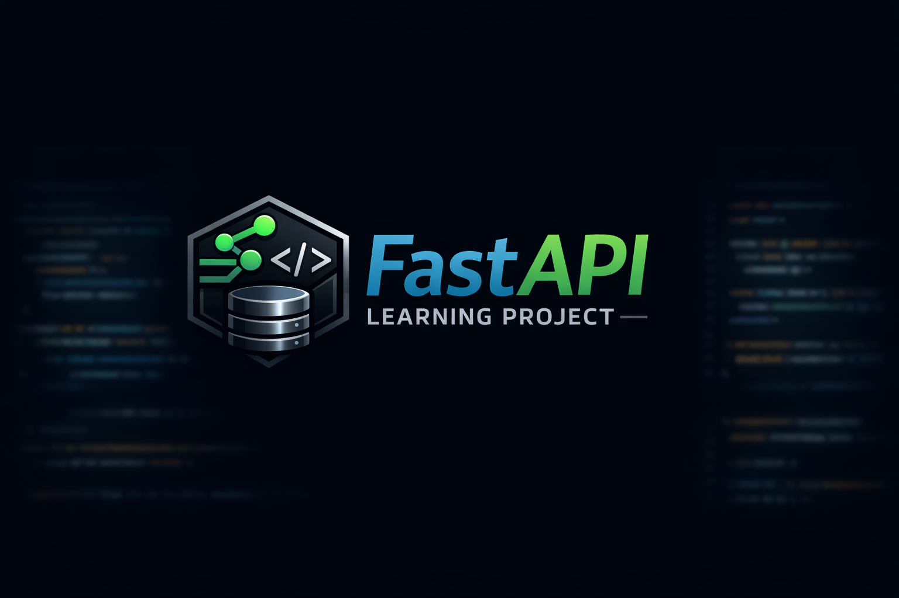

<p align="center">
  
</p>


# FastAPI Learning Project

A hands-on project exploring modern Python backend development using **FastAPI**, **Pydantic v2**, and clean architecture principles. 
Built as a practical learning journey into API design, routing, dependency injection, and service-layer organization.

---

## :rocket: Features

• FastAPI application with modular architecture
• Pydantic v2 models (`model_dump`, `model_validate`)
• Routers for clean endpoint organization
• Dependency Injection for shared resources
• In-memory database simulation (preparing for SQLModel/SQLite)
• Service layer for business logic separation
• Fully interactive API docs via Swagger (`/docs`)

---

## :open_file_folder: Project Structure

app/ api.py 
# FastAPI app entrypoint db.py 
# In-memory database + DI routes/ contacts.py 
# Contact-related API endpoints services/ contact_service.py 
# Business logic utils.py 
# (Optional utilities)

This structure mirrors real-world FastAPI applications and keeps the API layer clean and testable.

---

## :arrow_forward: Running the Project

Create and activate a virtual environment:

```bash
python -m venv .venv
source .venv/bin/activate   # macOS/Linux
.venv\Scripts\activate      # Windows

Install dependencies:
pip install fastapi uvicorn

Start the server:
uvicorn app.api:app --reload

Open the interactive API docs:
http://127.0.0.1:8000/docs
```
---

:mailbox_with_mail: Endpoints

POST /contacts
Create a new contact.

GET /contacts
List all contacts.

GET /contacts/{name}
Retrieve a contact by name.

---

:brain: Learning Goals

• Understand FastAPI’s request/response model
• Use Pydantic v2 for validation and serialization
• Apply dependency injection for shared state
• Structure a backend using routers and services
• Prepare for real database integration (SQLModel)

---

:scroll: License

MIT License — feel free to use, modify, and learn from this project.
